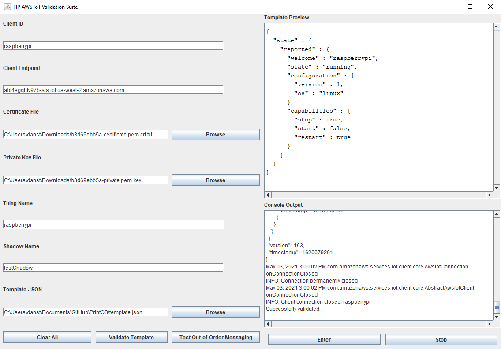

# PrintOS Project
This is our implementation of a version and shadow document validation suite to validate device configurations and version control.
This project has two applications, both of which do the same thing. One application (named Application) will run from the command 
line, and you can either pass it the required command line args or the other application (ApplicationGUI) which loads up a simple GUI to aid with
adding the required args.

To build you can import the project file into your preferred IDE (we used IntelliJ) and then build with Maven.
To build and run the application you prefer select the desired application and then build and run it. This can be done
by opening the file and then building with the hammer and then the green play to run it or by right-clicking and selecting build and run.

### Fleet Indexing:

Fleet Indexing code can be found in the `Fleet Indexing` folder. This contains code to access and query amazons fleet index for IoT, and create a simple query based on model type and serial number.
Due to issues with how AWS handles thing groups these functions are mostly deprecated but could be combed through to see example code to access AWS IoT
through the standard AWS SDK. The query syntax class is used to parse incoming jsons.

# Instructions

For connecting and validating a device or service, both the command-line and the GUI require the following information:
- Client ID
  - The client ID of the device (generally the same as the Thing name).
- Client Endpoint
  - The endpoint of the device. This is the direct link to the device in AWS. Generally follows the convention of `UNIQUE-NAME.iot.LOCATION.amazonaws.com`.
- Certificate File
  - The full path to the certificate file for the device.
- Private Key File
  - The full path to the private key file for the device.
- Thing Name
  - The Thing name (generally the same as Client ID).
- Shadow Name
  - Shadow name (leave blank if you want to use a classic shadow).
- Template JSON (Required for Template Validator Only)
  - The location of the JSON template that we're validating the shadow against.

## Command-Line

The command line can be ran either with or without command line arguments. If you run it without arguments, it will ask for each argument it needs, otherwise the arguments are specified in this order:

`clientId clientEndpoint certificateFile privateKeyFile thingName shadowName`

After the console has all of the information it needs, it will ask for you to enter either `0` or `1` to validate the shadow or test out-of-order messaging, respectively.

## GUI


In the above screenshot, we can see every detail necessary for connecting and validating our devices/services. It runs very similar to the console, except you can run the shadow validator or the out-of-order messaging within the same session without having to re-enter information.

After pressing the `Validate Template` button or the `Test Out-of-Order Messaging` buttons and the fields aren't empty, it will save them to a file named `last_settings.txt` so the next time you run the application, it will automatically fill in the fields with the last used values.

### Template Validation

For template validation, we can have a template that we expect from the device shadow. For each string of keys in the template, we want the device or service shadow to have those keys. Here's an example template:
```
{
    "state": {
        "reported": {
            "welcome": "raspberrypi",
            "state": "running",
            "configuration": {
                "version": 1,
                "os": "linux"
            },
            "capabilities": {
                "stop": true,
                "start": false,
                "restart": true
            }
        }
    }
}
```
Using this template, we want the validator to make sure the returned shadow has the same pattern (i.e., `state -> reported -> capabilities -> stop`). The validator doesn't care about what values are in there, so it doesn't care if the shadow's `stop` value is `true` or `false`, simply that it exists.

If all of the fields exist in the shadow, it will tell you that validation was successful. If it fails, it will tell you it was unsuccessful. Adding functionality on telling the user exactly _what_ is missing isn't implemented, but shouldn't be too difficult to change. Simply change reporting within the `ShadowValidator` class under the `compareJson()` or `recurseNode()` methods.

In the GUI, highlighting what color each line should be can be modified using the `templateColorStrings` list in `ApplicationGUI.java`. Each index of the colors in that list corresponds to a matching index in `templateStrings`. If you want the colors to match what fields successfully / unsuccessfully validated can be accomplished by modifying the color corresponding to that string.

### Out of Order Message Validation
#### TO RUN THE VALIDATOR
- Your named shadow's policy must include permissions to subscribe/publish to its  reserved MQTT topics `/get`, `/get/accepted`, `/get/rejected`, `/update`, `/update/accepted`, `/update/rejected`, `/update/delta`, as well as the client lifecycle MQTT topics (`$aws/events/presence/connected/[clientId]`, `$aws/events/subscriptions/subscribed/[clientId]`, and `$aws/events/subscriptions/unsubscribed/[clientId]`).
  - Note: The clientID in the lifecycle events MQTT topics is your application's clientID.
- Your named shadow's policy must include connection permissions for client ID 'wsu-validator'.
- Open the project in IntelliJ
- In Run/Debug Configurations:
  - Run Application `com.hp.sms.wsuiotdevice.Application` with java 11 SDK
  - CLI arguments:
    - `[clientID] [clientEndpoint] [certificateFile] [privateKeyFile] [thingName] [shadowName]`
- If arguments provided are not fulfilled, the validator will prompt you for them.
  
#### TO VALIDATE AN APPLICATION'S MQTT TOPICS AND OUT-OF-ORDER MESSAGE HANDLING
- Launch the validator.
- If the connection to the AWS IoT thing and its named shadow is successful, you will see the validator menu:
```
>>> VALIDATOR MENU <<<
  0 - Connect to AWS IoT and validate named shadow JSON document.
  1 - Connect to application and check MQTT subscriptions and out-of-order message handling.
```
- Type `1` and hit `Enter`
- The validator will prompt you to disconnect your application, if it has not already done so.
- Follow the validator's prompts.
